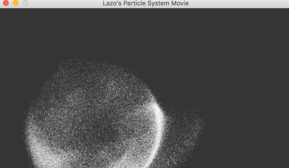
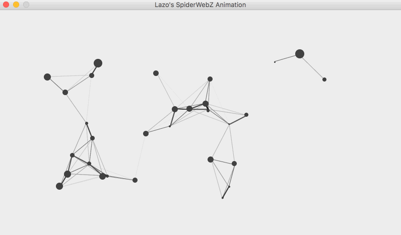

# Playground-for-Java-Graphics
A collection of small graphics related programs written in Java. Each folder contains a Window.java file. The Window.java file is the main point of entry to the program. To run the program navigate into one of the folders then type the following commands:
```
javac Window.java
java Window
```
The following contains a short description of each animation & simulation. I did not include a gif for each animation as I did not want to slow down the rate at which the page loads. Furthermore, the animations are much smoother than they appear in the gifs.

# Bart
An animation of orbs hovering around Bart Simpson.


# Bouncy Ball
A simulation of a ball that can be moved around with the arrow keys. The simulation includes gravity and the ball bounces off the walls.

# Bubbles
A simulation that creates expanding bubbles when the user clicks on the screen.

# DNA
An animation of a helix rotating.

# Flag
An animation of a flag waving.

# Image Segmentation
Processes a static image (such as a .png) and divides the image based on clusters of related colors. The user can then click on the image to highlight the cluster.


# MazeGenerator
Generates a random maze and prints it to the screen. The parameter determines the size (tiny, small, medium or large).
```
java Window -medium
```


# Particle System
A simulation of particles that follow the mouse.

# Particle System Movie
A pre-rendered simulation of particles. This simulation does not follow the mouse since it is pre-rendered. The benefit is that there is no limit as to the amount of particles that can be in the simulation, whereas "Particle System" can only have up to 15,000 particles before it starts to lag on my machine. The following gif has 100,000 particles.



# SpiderWeb
An animation of lines dancing across the screen.


# SpiderWebZ
An animation similar to SpiderWeb but with some small changes.



# SuperNova
Animates an explosion when the user clicks on the screen.

# TieDye
An animation of an expanding set of colors.


# Tornado
An animation of spheres orbitting in a circle as if there were a Tornado in the middle. Users can create orbs by clicking on a blank space and delete orbs by selecting an orb and then hitting the delete button. The left and right arrow keys rotate the spheres.


